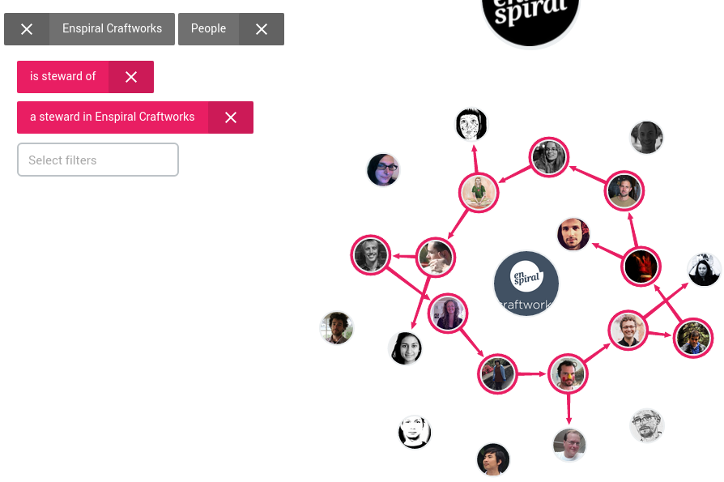

# Holodex

## What?

Holodex is the best way to discover, understand, and organize the emergence of fractal human networks.

We want to be a modular app within the [Open App Ecosystem](https://github.com/open-app/core), where other apps can rely on us as the single source of truth for people and groups' profile, role, and relationship information. We are not a "secure identity vault" that provides authentication (who you are as a cryptographic key), that is for another app.

This repo is the top-level repo for the project. You can find the app code repo [here](https://github.com/holodex/app).

### Features

- look into and across your human networks to find people
- understand who's wearing what hats in your group
- shape, size, and shift the structure of your organization
- manage responsibilities and accountabilities within your company
- track relationships amongst you and your peers
- dynamically burn and re-build your teams on demand

## [SCOPE](SCOPE.md)

## [CONTRIBUTING](./CONTRIBUTING.md)
